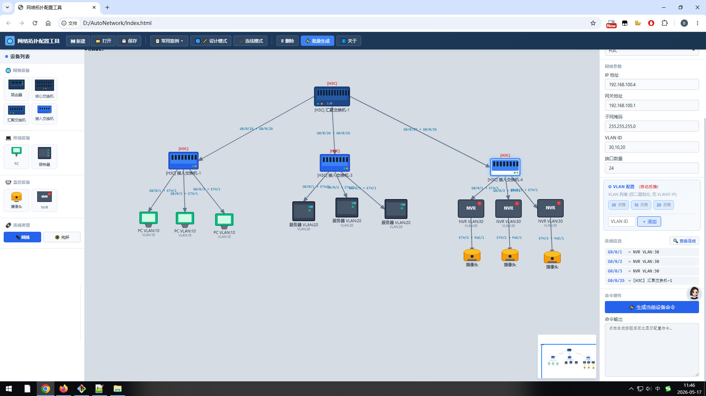
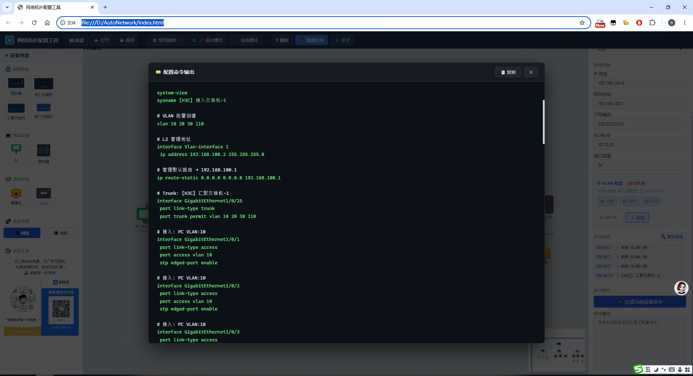

# net-topo-cmd-generator-web
网页端网络拓扑可视化工具，拖拽绘制交换机 / 路由器组网拓扑，一键自动生成华为、H3C、思科通用运维命令行，支持拓扑工程JSON 格式导入、导出、本地保存，纯前端免服务，网工日常组网配网极速出配置。
## 项目预览

# 网络拓扑图自动生成交换机命令行 Web 工具
纯前端轻量网页拓扑工具，无需后端，浏览器直接运行

## 功能特点
1. 可视化拖拽绘制网络拓扑，支持交换机、路由器、终端等设备
2. 自动解析拓扑结构，批量生成标准交换机配置命令行
3. 拓扑工程文件 **JSON 格式导出 / 导入**，跨设备复用拓扑
4. 本地缓存保存拓扑图纸，刷新不丢失
5. 支持 VLAN、Trunk、静态路由等常用场景配置生成
6. 无数据库、无部署依赖，单HTML即可离线使用

## 使用方式
1. 打开 index.html 进入拓扑编辑界面
2. 拖拽左侧设备搭建网络组网拓扑
3. 连线完成后一键生成对应厂商命令行
4. 支持导出 JSON 拓扑文件存档
5. 外部 JSON 拓扑可直接导入快速还原图纸

## 导出格式说明
- 拓扑工程：标准 `.json` 通用格式
- 配置脚本：纯文本命令行，可直接复制至设备终端执行

## 适配设备
华为交换机、H3C交换机、思科交换机、家用路由等主流网络设备

## 开源协议
MIT License
自由使用、二次开发、个人商用无限制

## 适用人群
网络运维工程师、网工学习、机房组网规划、校园网/企业网快速配网
